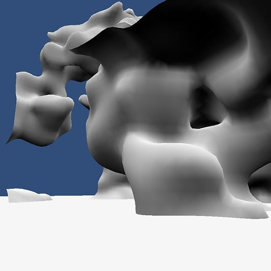

# Marching-Cubes-On-The-GPU

This project generates voxels and the mesh all on the GPU using a compute shader version of the marching cubes algorithm. The voxels are generated using a version of the improved Perlin noise done previously but running in a compute shader.

For practically reasons it maybe best to do this sort of thing using multi-threading on the CPU but I though it would still be useful to have a version running on the GPU. I have also included some code in the script to read back the generated mesh from the GPU and convert it into a normal mesh. I dont recommend doing this every frame but its there if you need it.

The scene generates 3D noise as the voxel values and then uses the marching cubes algorithm to convert the voxels to a mesh. As the mesh is generated using a compute shader the vertices are written to a compute buffer. Unity's draw procedural method is then used to render the buffer.

Using a buffer does present some issues. The buffer has to be a fixed size but the number of vertices generated is unknown until the algorithm is ran. To get around this I created a buffer that could hold the maximum number of vertices that the marching cubes can generate which is 5 triangles per voxel. When the algorithm runs only the generated vertices will be written to the buffer leaving all other vertices in the buffer as being zero filled. This means that when rendered a vertex shader is run for each vertex but as the triangle's have no area there is no fragment generated. This is a bit inefficient but I have compared the method with a buffer converted to a normal Unity mesh and there does not seem to be any difference in rendering performance. Maybe in a more complex scene it could become a issue. To get around this and only have the generated vertices in the buffer maybe some sort of set up with a append buffer or counter buffer (to generate indices for the vertices) would be better.

I have also added a stage to generate the smoothed normals by using the derivatives of the voxel values and interpolating them based on the vertices position. There is also a second scene that generates a new mesh every frame using 4D Perlin noise to make a animated voxel mesh.

